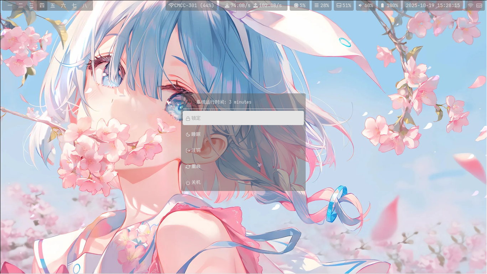

# AronaOS-dotfile

AronaOS-dotfile 是基于Manjaro Linux的hyprland桌面环境的dotfile配置文件

bilibili 视频链接：[什么？AronaOS【精剪版】](https://www.bilibili.com/video/BV17E411h73h/)

主界面

电源菜单

应用启动器


## 安装
```bash
git clone https://github.com/ywhdzrb/aronaos-dotfile.git
cd aronaos-dotfile
./install.sh
```

## 按键绑定

### 应用启动
| 按键 | 功能 | 命令 |
|------|------|------|
| `SUPER + D` | 应用启动器 | `rofi` |
| `SUPER + RETURN` | 终端 | `kitty` |
| `SUPER + S` | 浏览器 | `firefox` |
| `SUPER + E` | 文件管理器 | `thunar` |
| `SUPER + C` | VS Code（自己安装） | `code` |
| `SUPER + A` | QQ | `linuxqq` |
| `SUPER + W` | 微信 | `wechat.sh` |
| `SUPER + H` | Clash Verge | `clash-verge` |
| `SUPER + M` | QQ音乐 | `qqmusic` |

### 窗口管理
| 按键 | 功能 |
|------|------|
| `SUPER + Q` | 关闭当前窗口 |
| `SUPER + F` | 切换浮动窗口 |
| `SUPER + U` | 切换全屏 |
| `SUPER + 方向键` | 改变窗口焦点 |

### 工作区管理
| 按键 | 功能 |
|------|------|
| `SUPER + 1-0` | 切换到工作区 1-10 |
| `SUPER + SHIFT + 1-0` | 移动窗口到工作区 1-10 |
| `SUPER + 鼠标滚轮` | 滚动浏览工作区 |

### 布局控制
| 按键 | 功能 |
|------|------|
| `SUPER + P` | 伪平铺 (dwindle) |
| `SUPER + J` | 切换分割方向 |
| `SUPER + SHIFT + H` | 强制左右分割 |
| `SUPER + SHIFT + V` | 强制上下分割 |

### 鼠标控制
| 操作 | 功能 |
|------|------|
| `SUPER + 鼠标左键` | 移动窗口 |
| `SUPER + 鼠标右键` | 调整窗口大小 |

### 媒体控制
| 按键 | 功能 | 命令 |
|------|------|------|
| `亮度增加键` | 增加亮度 | `backlight --inc` |
| `亮度减少键` | 减少亮度 | `backlight --dec` |
| `音量增加键` | 增加音量 | `volume --inc` |
| `音量减少键` | 减少音量 | `volume --dec` |
| `静音键` | 切换静音 | `volume --toggle` |
| `播放/暂停键` | 播放/暂停 | `playerctl play-pause` |
| `下一曲键` | 下一曲 | `playerctl next` |
| `上一曲键` | 上一曲 | `playerctl previous` |

### 实用工具
| 按键 | 功能 | 命令 |
|------|------|------|
| `SUPER + V` | 剪贴板历史 | `cliphist` + `rofi` |
| `SUPER + SHIFT + S` | 区域截图 | `grim` + `slurp` |
| `SUPER + L` | 锁定屏幕 | `hyprlock` |
| `SUPER + SHIFT + E` | 电源菜单 | `powermenu.sh` |

